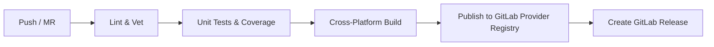

# CodeMie Terraform Provider

Terraform provider for managing CodeMie assistants, workflows, and skills through the CodeMie REST API.

- **GitHub Repository:** `https://github.com/cepidalim-epam/terraform-provider-codemie`
- **Terraform Registry:** `cepidalim-epam/codemie`

---

## Consuming the Provider

In your Terraform project (`versions.tf` or `main.tf`):

```hcl
terraform {
  required_version = ">= 1.5.0"

  required_providers {
    codemie = {
      source  = "cepidalim-epam/codemie"
      version = "~> 0.1.0"
    }
  }
}

provider "codemie" {
  # Direct attributes or environment variables:
  # CODEMIE_HOST, CODEMIE_TOKEN_URL, CODEMIE_CLIENT_ID, CODEMIE_CLIENT_SECRET
}
```

---

## Authentication & Credentials

The provider uses OAuth 2.0 client credentials. Configure attributes directly in the provider block or use standard environment variables:

| Parameter | Environment Variable | Description |
|-----------|----------------------|-------------|
| `host` | `CODEMIE_HOST` | Base URL of CodeMie API |
| `token_url` | `CODEMIE_TOKEN_URL` | OAuth2 Token endpoint URL |
| `client_id` | `CODEMIE_CLIENT_ID` | OAuth2 Client ID |
| `client_secret` | `CODEMIE_CLIENT_SECRET` | OAuth2 Client Secret (sensitive) |

```bash
export CODEMIE_HOST="https://codemie-api.example.com"
export CODEMIE_TOKEN_URL="https://auth.example.com/oauth/token"
export CODEMIE_CLIENT_ID="terraform-client"
export CODEMIE_CLIENT_SECRET="secret"
```

> **Security Note:** Never commit client secrets to version control.

---

## CI/CD Pipeline Lifecycle

The included `.gitlab-ci.yml` provides a production-grade automated pipeline:



1. **Lint**: Validates Go formatting (`gofmt`) and runs static analysis (`go vet`).
2. **Test**: Executes test suite with coverage reports (`go test -coverprofile`).
3. **Build**: Cross-compiles binaries for `linux_amd64`, `linux_arm64`, `darwin_amd64`, `darwin_arm64`, and `windows_amd64`, generating SHA256 checksums and zip archives.
4. **Publish**: Automatically uploads versioned provider packages and checksums to the GitLab Terraform Provider Registry (`/packages/terraform/providers/codemie/...`).
5. **Release**: On Git tags (e.g. `v0.1.0`), creates a tagged GitLab Release with links to package assets.

### Creating a Release

To trigger a production release build and publish to the package registry:

```bash
git tag v0.1.0
git push origin v0.1.0
```

---

## Local Development & Testing

Requires Go 1.24 or newer.

```bash
# Run tests and formatting
make test
make lint

# Package binaries for all architectures into dist/
make package

# Install provider locally for development overrides
make install-local
```

### Development Override (`~/.terraformrc`)

For local testing without querying the remote registry:

```hcl
provider_installation {
  dev_overrides {
    "cepidalim-epam/codemie" = "/path/to/codemie-terraform-provider"
  }
  direct {}
}
```